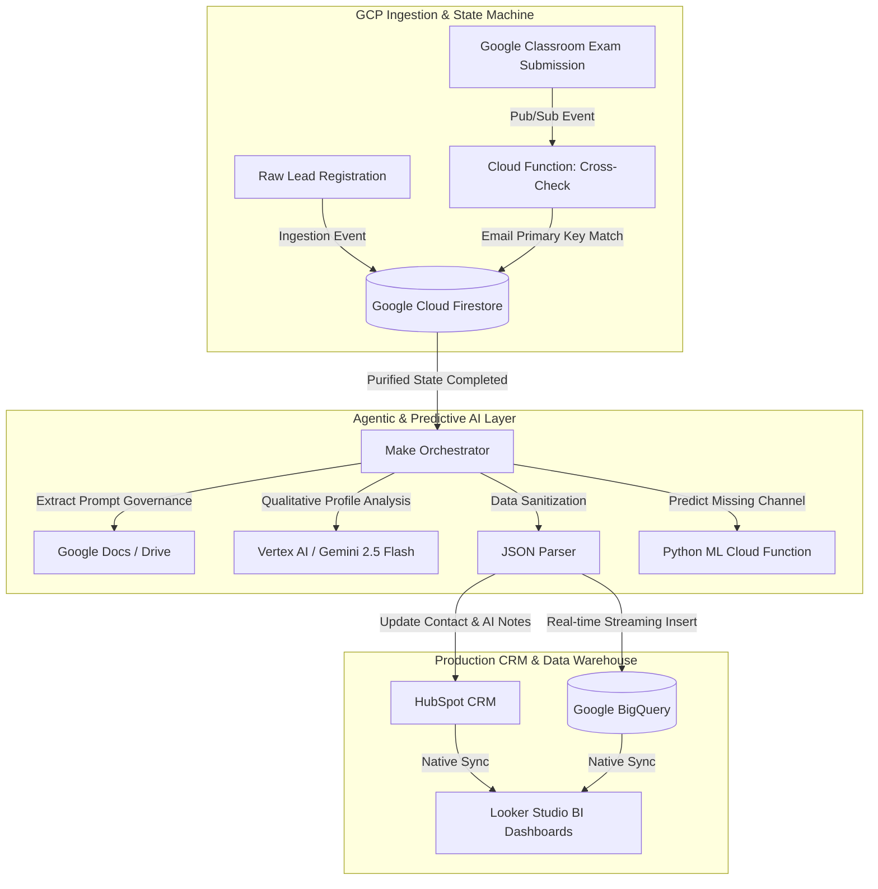

```markdown
# 🚀 MASTER PLAN: REVOPS ECOSYSTEM & AI AGENTIC HUB (V9)
### Enterprise Strategy: Predictive Intelligence (MLOps), Event-Driven Architecture, and State Consolidation (Firestore)


**PROFILE:** Michael Sancivier — Technical Product Owner & RevOps Process Specialist  
**CORE SKILLS:** Scrum | Six Sigma | FinOps Cloud Architecture | Data Pipeline Engineering | API Orchestration

---

## 📊 Data Impact Summary (Enterprise Optimization Metrics)

| Operational Metric | Real Volume / Impact |
| :--- | :--- |
| **Raw Candidates (Ingested Leads)** | 132,248 records |
| **Raw Students (Exam History)** | 15,356 records |
| **Total Raw Volume Processed** | **147,604 records** |
| **Consolidated Unique Entities (Target: Brazil)** | **11,600 records** |
| **Noise Reduction Rate (Geofencing & Deduplication)** | **~92% optimization** |
| **Structural Operating Cost (Make Orchestration)** | **$0.00 USD** (1 single operation per completed cycle) |

---

## 1. 🎯 Strategic Vision: From MVP to Full Enterprise Ecosystem

This repository documents the evolution to **Version 9** of a previously manual operational process into an automated, event-driven enterprise architecture governed by Predictive Artificial Intelligence (**MLOps**).

Designed under Continuous Improvement principles (**Six Sigma**) and Privacy by Design (**LGPD/GDPR**), this ecosystem unifies data silos and optimizes financial resources (**FinOps**). The core architectural milestone of this version is establishing **Google Cloud Platform (GCP)** as the central ingestion engine, solving end-to-end data traceability, isolating cross-regional markets (geofencing Brazil vs. Argentina datasets), and completely eliminating operational blind spots.

---

## 🧠 AI-Native Engineering & Orchestration Paradigm

This project was architected and deployed by leveraging Generative AI as an active engineering copilot. Rather than manually writing traditional boilerplate code line-by-line, AI tools were directed to generate, optimize, and stress-test SQL multi-tier transformations, Python serverless microservices, and API integration payloads under a strict System Architecture and Product Owner vision. 

This methodology bridges business strategy with technical execution, accelerating delivery cycles while maintaining total architectural control, code governance, and FinOps efficiency.

---

## 2. ⚡ FinOps Architecture: Cloud State Machine (GCP) & Dual Ingestion Reconciliation

To ensure enterprise scalability without triggering software licensing costs or overloading transactional webhooks, the architecture integrates **Google Cloud Pub/Sub** and **Cloud Firestore** as an elastic cloud state machine.

The workflow removes third-party dependencies for early state management, enabling seamless reconciliation using the **candidate's email address** as the universal primary key:

* 📩 **Ingestion Event (Lead Origin):** Newly registered leads land directly in GCP, creating an initial profile document in **Firestore** (`status: Pending Evaluation`) at $0.00 cost.
* 📝 **Evaluation Event (Cross-Check):** Upon completing an exam in **Google Classroom**, Pub/Sub triggers a Cloud Function that executes a real-time cross-check in Firestore, using the candidate's **email** to aggregate exam scores into the existing profile.
* 🚀 **Purified Trigger (Webhook):** Once the State Machine confirms a fully qualified profile, it emits **a single purified HTTP trigger to Make**, orchestrating the final sync into **HubSpot CRM** and **BigQuery** without redundant intermediate runs.

---

## 🏗️ System Architecture Diagram



---

## 3. 🗺️ Development Roadmap by Milestones (V9)

### 🔹 Milestone 1: Data Engineering & Geographic Market Isolation (Zoho Analytics ETL)

* **Situation:** The legacy Data Warehouse (Zoho Analytics) exhibited high operational fragmentation, holding 147,604 raw records mixed between candidate leads (132,248) and evaluated student histories (15,356), with overlapping data across Latin American markets (including Brazil and Argentina).
* **Task:** Design and execute an Enterprise-grade ETL pipeline (*Staging, Transformation, Production*) to clean the database, isolate the Brazilian market via **Geofencing** logic, and consolidate high-fidelity unique entities for ML model training.
* **Action:** Refactored complex SQL queries by applying strict relational joins and conditional business logic to deduplicate, unify candidate history, and drop incomplete or out-of-scope regional records.
* **Result:** Compressed data volume from **147,604 raw rows to 11,600 unique, validated entities**, achieving a **92% noise reduction rate** and delivering a pristine dataset optimized for Machine Learning.

### 🔹 Milestone 2: Data Anonymization & Dual Ingestion Simulation

Generated 150 synthetic records in Python (`Faker pt_BR`) with intentional null-value injection to stress-test the predictive pipeline while avoiding exposure of Personally Identifiable Information (PII), ensuring strict LGPD and GDPR compliance. The script simulates both the "Ingestion Event" (lead creation) and the "Evaluation Event" (Classroom submission) sharing matching emails to validate primary key reconciliation and state machine resilience.

### 🔹 Milestone 3: Enterprise Base Environments Provisioning

Deployed the Sandbox environment in HubSpot with mapped custom properties (*Acquisition Source, ML Confidence Score*). Provisioned the Google Cloud Platform project under the 100% Free Tier, configuring Cloud Firestore and activating Pub/Sub topics for asynchronous event handling.

### 🔹 Milestone 4: Data Warehouse Migration to BigQuery

Replaced legacy spreadsheet silos with BigQuery as an elastic columnar analytical engine, standardizing geographical data mappings via serverless SQL queries.

### 🔹 Milestone 5: Dual Ingestion & Serverless State Machine (Core MLOps V9)

Packaged the Machine Learning model (`model.pkl`) into an HTTP Google Cloud Function (Python 3.10). Configured lead ingestion endpoints in Cloud Firestore and Pub/Sub event topics for Google Classroom, converting Firestore into a $0.00 USD State Machine that consolidates complete profile records by email.

### 🔹 Milestone 6: Event-Driven Smart Orchestration with Make

Built the master scenario in Make with conditional routing (*Router*). The orchestrator no longer manages raw state logic; it receives a single purified HTTP payload from GCP upon cycle completion, syncing data into **HubSpot CRM** and **BigQuery** via Gemini 2.5 Flash while minimizing operational consumption.

### 🔹 Milestone 7: Governance & Business Dashboards (Looker Studio)

Established native connections to BigQuery and HubSpot CRM to visualize infrastructure health, marketing channel attribution, and AI model performance metrics (*Confidence Scores*) in real time.

### 🔹 Milestone 8: Impact Documentation & Storytelling (README)

Published the master case study using the STAR framework (*Situation, Task, Action, Result*), focusing on ROI, FinOps strategies, and technical debt elimination for the final GitHub video presentation.

---

## 📁 Repository Structure

```text
crm-data-pipeline-evolution/
├── v1-mvp-staging/
│   ├── apps_script_code.js         # Legacy Google Apps Script (MVP)
│   ├── generate_fake_data.py       # Dual Ingestion Synthetic Data Generator (Faker)
│   ├── students_synthetic_input.csv# Anonymized synthetic dataset (LGPD compliant)
│   └── zoho_analytics_dedup.sql    # 3-Layer SQL Pipeline with Geofencing (Brazil target)
├── v2-enterprise-target/
│   ├── cloud-functions/
│   │   ├── main.py                 # Serverless MLOps inference endpoint
│   │   ├── model.pkl               # Trained ML Model (Scikit-Learn)
│   │   ├── model_columns.pkl       # Column mapping metadata
│   │   └── requirements.txt        # Python dependencies
│   ├── bigquery-sql/
│   │   └── census_mapping.sql      # Geographical normalization queries
│   └── make-scenarios/
│       ├── integration_webhooks.json # Scenario 1: Predictive Router
│       └── hub_maestro_agentic.json  # Scenario 2: Agentic Vertex AI Pipeline
├── .gitignore                      # Security exclusion rules
└── README.md                       # Master Repository Documentation

```
